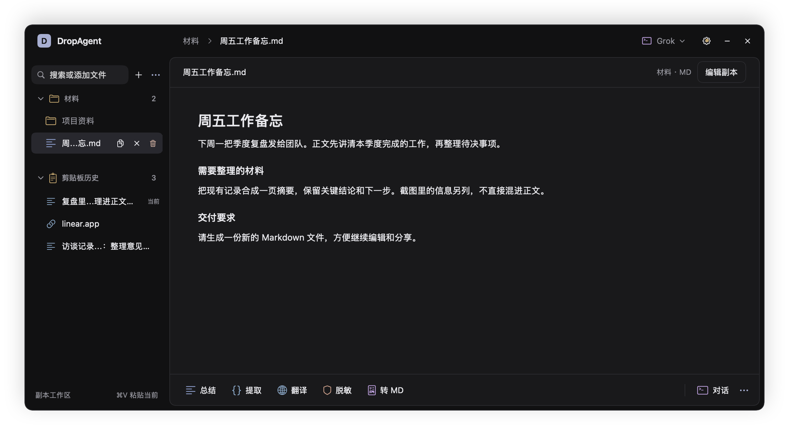
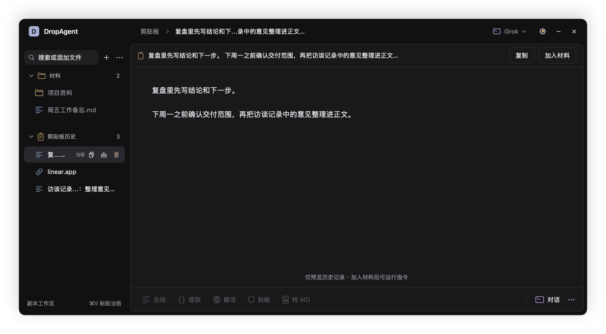
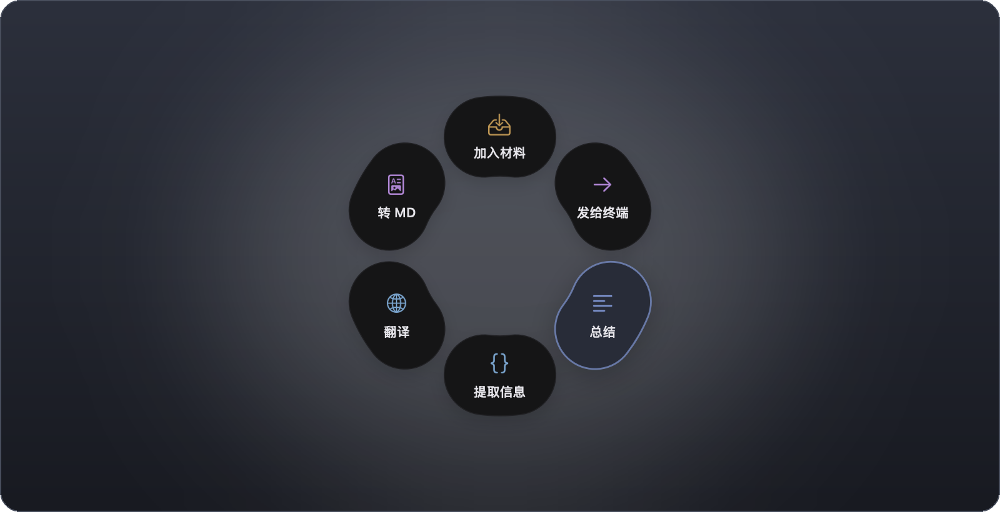

# DropAgent

[](https://github.com/molis-ai/DropAgent/actions/workflows/check.yml)
[](https://github.com/molis-ai/DropAgent/releases/latest)

**菜单栏上的 Agent 置物架。** 把 PDF、截图或链接先放着，在副本上处理，新文件出现在结果区，再拖走。原件不动。

A macOS menu bar shelf for the coding agent you already have. Stage first, run on a copy, drag the new file out.



左侧选材料，右侧看内容，指令常驻下方。结果可一键展开原文对照。剪贴板历史默认可见，点选只预览，需要处理时再加入材料。

已发布版本 **0.1.0**。[下载 macOS 安装包](https://github.com/molis-ai/DropAgent/releases/tag/v0.1.0)（macOS 14+，Apple Silicon）。本文截图来自当前源码工作台；v0.1.0 下载包仍为此前布局，新界面可从源码打包。

## 它解决什么

这些 Agent 习惯对着代码仓库干活。手头却常常只是一份报价 PDF、一张截图、一篇网页：你不想 `cd` 进某个项目，也不想让它改原文件。

1. 拖到菜单栏，或打开面板放到文件架。此时还不跑。
2. 点开看内容。要跑动作时，先看到读什么、写哪里、是否联网、隔离是哪一档。
3. 左侧结果组出现新文件，材料仍在。把产出拖到桌面、Finder 或上传框。



成功时你看到的是：**原件不动，材料与结果都在，内容可以直接读。**

拖文件时，指针旁可出现六瓣轮盘：加入材料、发给终端、总结、抽取、翻译、转 MD。圆心是空的；拖出外圈即消失。



## 和现有做法差在哪

| 你现在可能在做的事 | 这里怎么处理 |
| --- | --- |
| 把文件丢进某个 git 项目，让 Agent 直接改 | 复制进一次性任务目录；Prompt 不写原件路径；跑完校验原件 Hash |
| Yoink / Dropover 只暂存 | 架子还在，但可以选动作，结果作为新文件拿走 |
| 在终端里对着原路径开工 | 快捷动作在副本里跑；发给终端时会写明「不是副本沙箱」 |

六个 CLI 动作需要本机已装、有无界面入口的终端 Agent：

| 动作 | 新文件（不改原件） |
| --- | --- |
| 总结 | `summary.md` |
| 抽取 | `extracted.json` |
| 翻译并保留格式 | `translated.md` |
| 脱敏 | `redacted.md` |
| 转 Markdown | `converted.md` |
| 整合（至少两份材料） | `brief.md` |

选中图片或 PDF 时还有「文字提取」：图片用本机 Vision 写出 `ocr.md`，PDF 抽出可选中文字写出 `pdf.md`。**不需要终端 Agent，也不上网。** 扫描件 PDF 会标明没有可选中的文字。

没装可用 CLI 时，不会偷偷调云端。架子仍可用来暂存、预览和拖出。

## 开始使用

### 下载安装包

1. 从 [v0.1.0 Release](https://github.com/molis-ai/DropAgent/releases/tag/v0.1.0) 下载 `DropAgent-v0.1.0-macos-arm64.zip`。
2. 解压，把 `DropAgent.app` 拖进「应用程序」，然后打开。安装包不需要 Xcode 或 Swift。
3. 点菜单栏的 DropAgent 图标，从「试用示例 PDF」开始。

要求 macOS 14 或更新版本、Apple Silicon（M 系列）Mac。本次二进制不支持 Intel。

v0.1.0 使用 adhoc 签名，尚未经过 Apple 公证。若系统拦截，确认下载自本仓库后，按 [Apple 的说明](https://support.apple.com/zh-cn/102445)，在尝试打开后前往「系统设置 → 隐私与安全性 → 仍要打开」。无需关闭系统整体安全保护。

第一次成功**不要求**已装 Grok / Codex。有 Agent 再跑总结、翻译。

### 从源码构建

需要 macOS 14+ 和 Swift 6 工具链（Xcode 或 Command Line Tools）。在仓库根目录：

```bash
bash macos/package-app.sh
open macos/dist/DropAgent.app
```

有 Developer ID 就按开发者证书签；否则做 adhoc 签名。应用在菜单栏，Dock 里没有图标。`macos/dist/` 不进 git。

发布优化构建使用 `DROPAGENT_CONFIGURATION=release bash macos/package-app.sh`。

打开后面板在菜单栏图标下方。第一次可以点「试用示例 PDF」，或选择自己的文件。示例从提取文字到拿走新文件，无需 Agent 或权限。设置 → 使用指南可以再次试用。

**不依赖 Agent 的最短路径：**

1. 拖一张截图或一份可选中文字的 PDF 到文件架（或点 `+`）。
2. 点左侧文件，右侧出现内容。
3. 点「提取文字」，确认处理范围，再点「开始提取」。
4. 左侧结果组出现 `ocr.md` 或 `pdf.md`。原材料仍在，可以拖走结果。

CLI 动作的隔离按探测结果写。Codex / Gemini 在官方能力支持时显示 Workspace Sandbox；Claude 和自定义 CLI 是 Safe Copy（原件不被 DropAgent 覆盖，宿主进程仍可能访问其他位置）。探测不到就写「未确认」，不会把未验证的限制说成严格沙箱。第一版没有容器级 Strict Isolation。

### 权限

只暂存、预览、文字提取：不需要辅助功能。

抓当前网页（⌃⌥W）会申请：

- 辅助功能：读前台浏览器的地址和标题
- 自动化：问 Safari / Chrome / Edge 当前网址
- 屏幕截图：给前台窗口拍一张

拒绝后仍可拖文件、粘贴、抽字。系统对话框里的说明见 App 的用途字符串。

默认快捷键（设置里可改）：

| 快捷键 | 作用 |
| --- | --- |
| ⌃⌥D | 打开 / 关闭面板 |
| ⌃⌥W | 把当前 Safari / Chrome / Edge 页加入架子 |
| ⌃⌥A | 加入前台选中的本地文件 |
| ⌘V | 从剪贴板贴入 |

## 换成自己的材料

把示例换成自己的文件即可。

- 拖 PDF、图片、文件夹、文本或链接到**文件架**，或点 `+`、搜索本机文件。在 Finder 里复制文件，也会直接出现在文件架上（原件不动）。
- 点「对话」打开终端会话，不会生成新文件。发给终端请拖到轮盘「发给终端」。拖进打开的面板是加入材料。

- 浏览器最前时按 ⌃⌥W 抓当前页。拖入或粘贴网址也会去抓正文；登录墙后的正文不承诺能拿到。
- 多选后用「整合」得到一份 `brief.md`。
- 结果可复制、拖到别的窗口，或「用作材料」。多选时一次拖出所选项。网站抓取拖出的是文件夹：链接、`page.md`、截图。

轮盘可在设置 → 外观关掉。关掉后，菜单栏图标和文件架仍接拖入。

预置 TUI：Grok、Claude、Gemini、OpenCode、Cursor CLI、Codex、Kimi Code、CodeBuddy、Qwen Code。设置里可以输入命令名或选择可执行文件，添加自定义 Runtime。

## 现在不会做的

- 不覆盖原文件，不把结果自动写回原路径。
- 不加载用户全局 MCP、Hooks、项目规则。
- 不解析 TUI 画面，不模拟键盘去点终端菜单。
- 不接云端 API / Ollama，不上 Mac App Store。
- 不为某一家办公套件、聊天软件或 AI 桌面做插件。
- 不把扫描件 PDF 当成已经 OCR 完成。

## 许可

[MIT](LICENSE)。终端内嵌用了 [SwiftTerm](NOTICE)（MIT）。

## 开发

产品事实以 [`01-requirements.md`](01-requirements.md)、[`02-prototype-design.md`](02-prototype-design.md) 为准。怎么改见 [`CONTRIBUTING.md`](CONTRIBUTING.md)。漏洞请走 [`SECURITY.md`](SECURITY.md)。

```bash
cd macos && swift run DropAgentCheck
cd macos && swift build --product DropAgent
DROPAGENT_ROOT=/tmp/dropagent-preview-root macos/.build/debug/DropAgent --preview
```

`--preview` 把当前界面各状态写到 `/tmp/dropagent-preview/`。

工作台定向验证：`DROPAGENT_ROOT=/tmp/dropagent-workbench-check macos/.build/debug/DropAgent --e2e --workbench-only`，截图写到该根目录的 `ui/`。
