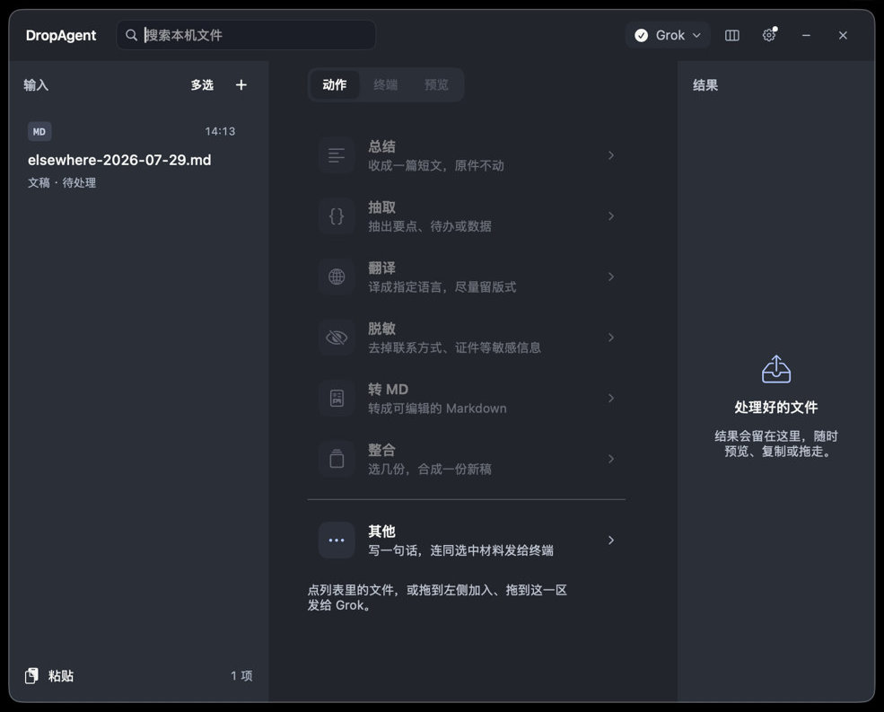
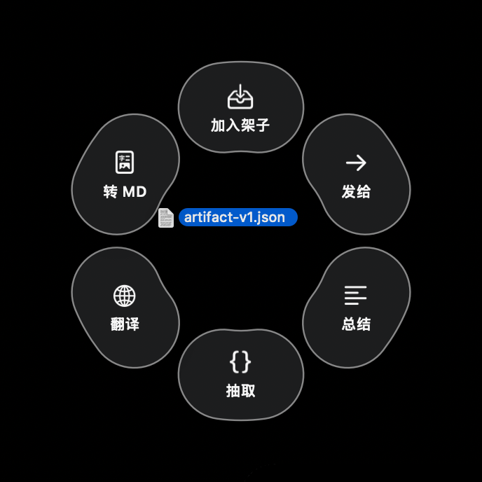
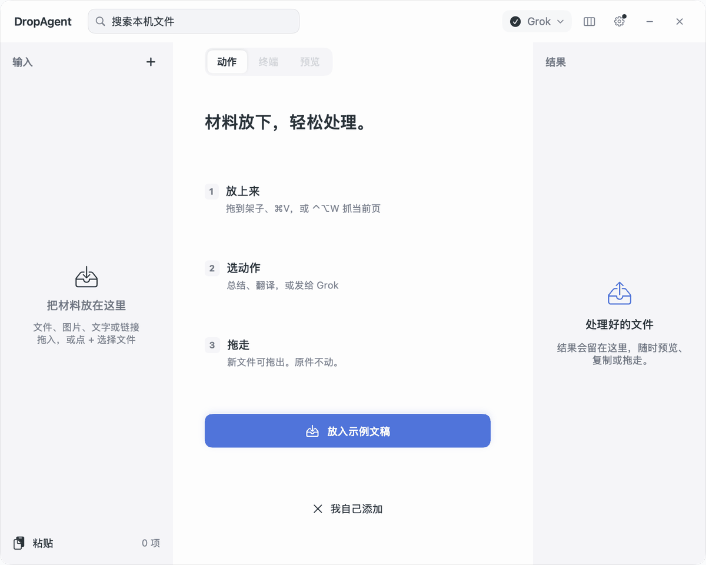
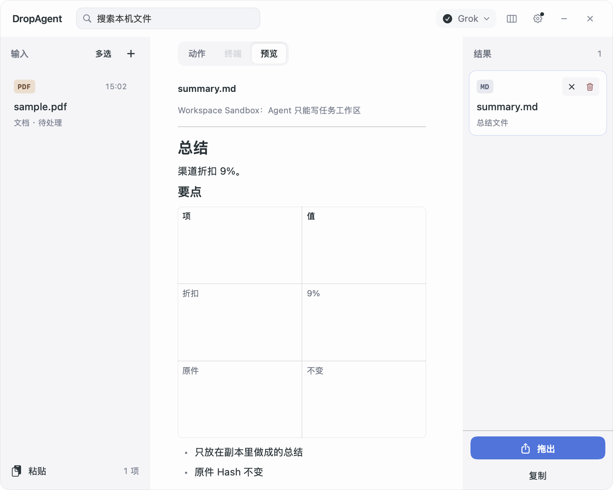
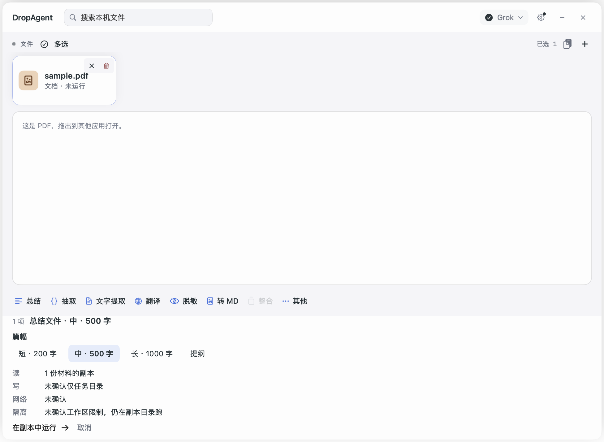
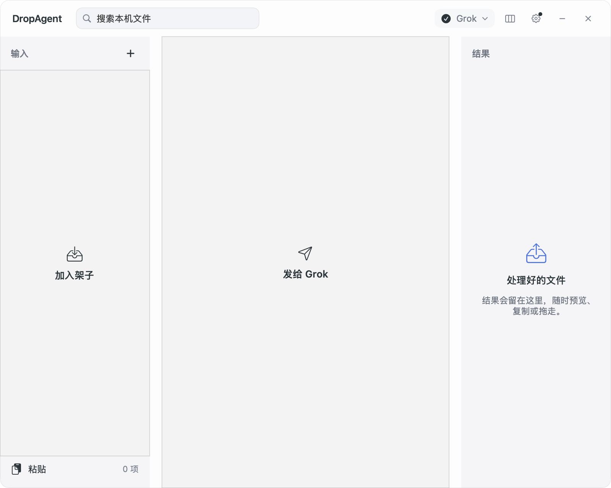

# DropAgent

**菜单栏上的 Agent 置物架。** 把 PDF、截图或链接先放着，交给本机已经装好的 Grok、Codex、Claude 或 Gemini 处理**副本**，新文件出现在右侧，再拖走。原件不动。

A macOS menu bar shelf for the coding agent you already have. Stage first, run on a copy, drag the new file out.



拖文件时，指针旁出现六瓣轮盘：加入架子、发给终端、总结、抽取、翻译、转 MD。圆心是空的；拖出外圈即消失，不开关面板。





当前是可以在本机打包运行的 macOS 菜单栏工具（0.1.0）。不上 Mac App Store，也不提供云端模型。深色面板和轮盘是运行中的真实截图；循环 GIF 来自界面预览，材料是合成样例。

## 它解决什么

这些 Agent 习惯对着代码仓库干活。手头却常常只是一份报价 PDF、一张截图、一篇网页：你不想 `cd` 进某个项目，也不想让它改原文件。

DropAgent 给它们一个项目之外的投递口：

1. 拖到菜单栏，或打开面板放进左侧架子。此时还不跑。
2. 选一个动作。运行前能看到读什么、写哪里、是否联网、当前是哪一档隔离。
3. 右侧出现新文件。左侧输入还在。把产出拖到桌面、Finder 或上传框。



成功时你看到的是：**原件还在左边，新文件在右边，中间可以预览。** 不是 Agent 启动了就算完。

## 和现有做法差在哪

| 你现在可能在做的事 | 这里怎么处理 |
| --- | --- |
| 把文件丢进某个 git 项目，让 Agent 直接改 | 复制进一次性任务目录；Prompt 不写原件路径；跑完校验原件 Hash |
| Yoink / Dropover 只暂存 | 架子还在，但可以选动作，结果作为新文件拿走 |
| 在终端里对着原路径开工 | 快捷动作在副本里跑；发给终端时会写明「不是副本沙箱」 |

六个 CLI 动作和对应产出：

| 动作 | 新文件（不改原件） |
| --- | --- |
| 总结 | `summary.md` |
| 抽取 | `extracted.json` |
| 翻译并保留格式 | `translated.md` |
| 脱敏 | `redacted.md` |
| 转 Markdown | `converted.md` |
| 整合（至少两份材料） | `brief.md` |

选中图片时还有「文字提取」：本机 Vision 写出 `ocr.md`，不需要终端 Agent，也不上网。

没装可用 CLI 时，不会偷偷调云端。架子仍可用来暂存和拖出。

## 开始使用

需要：

- macOS 14+
- Swift 6 工具链（Xcode 或 Command Line Tools）
- 本机已登录的终端 Agent。预置 TUI：Grok、Claude、Gemini、OpenCode、Cursor CLI、Codex；预置纯 CLI：llm、aichat、sgpt。设置里可以加自定义 Runtime。

在仓库根目录：

```bash
bash macos/package-app.sh
open macos/dist/DropAgent.app
```

有 Developer ID 就按开发者证书签；否则做 adhoc 签名。应用在菜单栏，Dock 里没有图标。`macos/dist/` 不会进 git，每次从源码打包。

第一次打开会看到三步：**放上来 → 选动作 → 拖走。** 点「放入示例文稿」，架子上出现 `先读我.md`。选「总结」，看权限条，点「在副本中运行」。成功时右侧出现 `summary.md`，左侧示例还在。



隔离按探测结果写。Codex / Gemini 在官方能力支持时显示 Workspace Sandbox；Claude 和自定义 CLI 是 Safe Copy（原件不被 DropAgent 覆盖，宿主进程仍可能访问其他位置）。探测不到就写「未确认」，不会把未验证的限制说成严格沙箱。第一版没有容器级 Strict Isolation。

默认快捷键（设置里可改）：

| 快捷键 | 作用 |
| --- | --- |
| ⌃⌥D | 打开 / 关闭面板 |
| ⌃⌥W | 把当前 Safari / Chrome / Edge 页加入架子（网址、正文 Markdown、窗口截图；不装扩展） |
| ⌃⌥A | 加入前台选中的本地文件 |
| ⌘V | 从剪贴板贴入 |

## 换成自己的材料

示例跑通之后，把 `先读我.md` 换成自己的文件即可。

- 拖 PDF、图片、文件夹、文本或链接到**左侧**，或点 `+`、搜索本机文件。
- 拖到**中间**是发给当前终端，不是加入架子。



- 浏览器最前时按 ⌃⌥W 抓当前页。拖入或粘贴网址也会去抓正文；登录墙后的正文不承诺能拿到。
- 多选后用「整合」得到一份 `brief.md`。
- 点「其他」写一句话，连同选中材料发给终端。那一次走该 Agent 自己的权限，界面会写明不是副本沙箱。
- 结果可复制、拖到别的窗口，或拖回左侧当新材料。多选时一次拖出所选项，复制不是挪走。网站抓取拖出的是文件夹：链接、`page.md`、截图。

轮盘可在设置 → 外观关掉。关掉后，菜单栏图标和左侧列表仍接拖入。

## 现在不会做的

- 不覆盖原文件，不把结果自动写回原路径。
- 不加载用户全局 MCP、Hooks、项目规则。
- 不解析 TUI 画面，不模拟键盘去点终端菜单。
- 不接云端 API / Ollama，不上 Mac App Store。
- 不为某一家办公套件、聊天软件或 AI 桌面做插件。

## 开发

产品事实以 [`01-requirements.md`](01-requirements.md)、[`02-prototype-design.md`](02-prototype-design.md) 为准。分包和禁区见 [`AGENTS.md`](AGENTS.md) 与 [`03-tech-architecture.md`](03-tech-architecture.md)。

```bash
cd macos && swift run DropAgentCheck
cd macos && swift build --product DropAgent
DROPAGENT_ROOT=/tmp/dropagent-preview-root macos/.build/debug/DropAgent --preview
```

`--preview` 会把当前界面各状态写到 `/tmp/dropagent-preview/`。循环 GIF 和权限 / 结果静帧来自这次输出。
