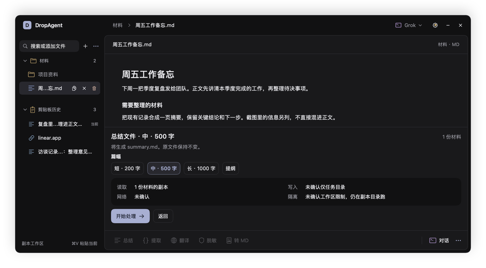
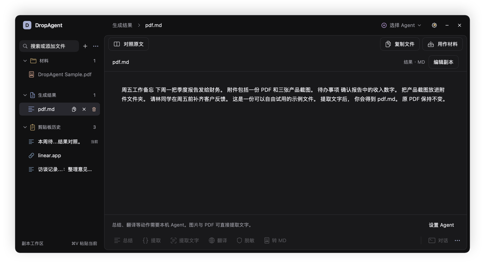
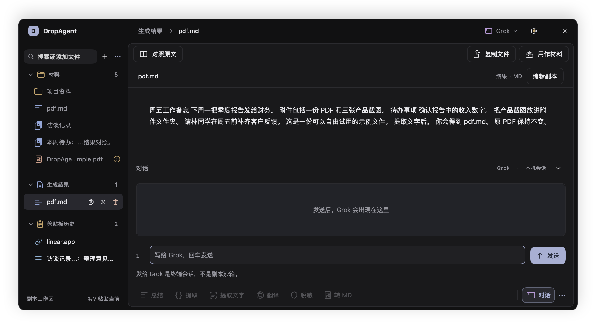

# DropAgent

[](https://github.com/molis-ai/DropAgent/actions/workflows/check.yml)
[](https://github.com/molis-ai/DropAgent/releases/latest)

**菜单栏上的 Agent 置物架。** 把 PDF、截图或网页先放着，需要时在副本上处理，新文件出现在结果区，拖走就行。原件一个字节都不动。

A macOS menu bar shelf for the coding agent you already have. Stage first, run on a copy, drag the new file out.


已发布 **0.2.0**。[下载 macOS 安装包](https://github.com/molis-ai/DropAgent/releases/tag/v0.2.0)（macOS 14+，Apple Silicon）。

## 为什么要有这么个东西

你已经装了 Codex / Claude Code / Gemini CLI，它们很能干——前提是**有一个项目目录**。

手上这份东西却往往不是项目：一份报价 PDF、一张聊天截图、一篇要读的网页。为了让 Agent 碰它，你得临时找个目录把文件拷进去、开终端、`cd`、把「要什么、写到哪」讲清楚，跑完还得确认它没顺手改了原件。本来十几秒的事摊成几分钟，而且每来一份文件就重来一遍。

DropAgent 把这几分钟压回菜单栏上的三步。

### 1 · 放进来，可以先不跑

拖到菜单栏图标、拖进面板任意处，或者 ⌃⌥A（前台选中的文件）、⌃⌥W（当前网页）、⌘V（剪贴板）。在 Finder 里复制文件也会直接出现在架子上。

加入的那一刻 DropAgent 就把它**复制**进自己的工作区，并记下原件的 SHA-256。之后所有动作只碰副本。放着不跑也行——架子本来就是拿来放东西的。

### 2 · 动手之前，先看清楚它要干什么

点「总结」这类动作，面板下方先摊开这次的四件事：**读什么、写到哪、是否联网、隔离是哪一档**，以及会生成的文件名。你点「开始处理」它才开始。



注意上图写的是「未确认工作区限制，仍在副本目录跑」，而不是某个听起来很安全的词。探测不到就照实说，不会把没验证过的限制包装成沙箱。

### 3 · 结果是一个新文件，拿走就是



新文件出现在左侧「生成结果」，原材料还在「材料」里。可以「对照原文」左右并排看，可以「复制文件」，可以直接拖到 Finder、桌面、上传框、邮件附件或聊天窗口，也可以「用作材料」接着跑下一轮。

跑完 DropAgent 会再算一次原件的哈希。真变了，这条结果标成失败并写明「原件中途变了，结果按副本做的」，不会假装成功。

成功长这样：**原件没动，材料和结果都在，两边都能直接读。**

## 拖着文件不放，轮盘会来找你


菜单栏图标很小，全屏时还会整条藏起来。所以拖动文件时指针旁会浮出六瓣轮盘：加入材料、发给终端、总结、提取信息、翻译、转 MD。

圆心是空的——不想选就停在中间，拖出外圈即消失。轮盘避开屏幕顶部的标签栏，不挡浏览器拖标签。设置 → 外观可以整个关掉；关掉之后菜单栏图标和面板照常接拖入。

## 没有 Agent 也能用起来

图片和 PDF 的「提取文字」是**本机**做的：图片走 Vision OCR 生成 `ocr.md`，PDF 走 PDFKit 抽出可选中文字生成 `pdf.md`。不需要任何 CLI，不联网。扫描件 PDF 会明说没有可选中的文字，不会假装 OCR 过了。

没装可用 CLI 的时候，DropAgent 不会偷偷调云端 API。架子仍然可以暂存、预览和拖出。

要终端 Agent 的六个动作，产出都是新文件：

| 动作 | 新文件 | 说明 |
| --- | --- | --- |
| 总结 | `summary.md` | 可选短 200 字 / 中 500 字 / 长 1000 字 / 提纲 |
| 抽取 | `extracted.json` | 结构化字段 |
| 翻译并保留格式 | `translated.md` | |
| 脱敏 | `redacted.md` | |
| 转 Markdown | `converted.md` | |
| 整合 | `brief.md` | 至少两份材料 |

结果重名会变成 `brief 2.md`。「整合」必须交出合成稿：Agent 只回一句「已把三份材料整合完成」会判为失败，不会当成结果。

预置 Runtime：Grok、Claude、Gemini、OpenCode、Cursor CLI、Codex、Kimi Code、CodeBuddy、Qwen Code。设置里也可以填命令名或直接选可执行文件，添加自定义 Runtime。

## 隔离档位照实说

跑动作前 DropAgent 探测 Agent 的能力，然后在确认页写下面三句中的一句，一字不改：

| 确认页上的原话 | 什么时候出现 |
| --- | --- |
| Workspace Sandbox：Agent 只能写任务工作区 | 只有 Codex，且 `codex exec` 确实支持沙箱参数时 |
| 未确认工作区限制，仍在副本目录跑 | 其余所有情况。副本目录之外 DropAgent 不做保证 |
| 在终端执行，不是副本沙箱 | 「对话」和轮盘的「发给终端」 |

第一版没有容器级的 Strict Isolation，这里也不会假装有。

不论哪一档，DropAgent 自己都不覆盖原文件、不把结果写回原路径、不加载你的全局 MCP / Hooks / 项目规则。材料副本在 `~/Library/Application Support/DropAgent/Inbox/`，结果在 `Jobs/`，位置可以在设置里改。

## 「对话」是终端，不是沙箱



「对话」在面板里开一个真的终端会话，用 Agent 自己的权限跑，不受副本目录约束——界面上就这么写着。它不生成结果文件。

嵌入的终端里看不见也点不了各家的批准卡，所以预置 TUI 会带着对应的自动批准参数启动（Codex `--ask-for-approval never`、Claude `--permission-mode bypassPermissions`、Gemini / Cursor / Kimi / Qwen `--yolo` 等）。**动作（Recipe）不受影响，照样要你点确认。**

## 剪贴板历史：点了只是看


剪贴板历史默认就在目录里。点一条只是预览——不改系统剪贴板，也不进材料。要处理时按「加入材料」，才复制一份进来。

## 和你现在的做法比

| 你现在可能这么干 | 这里怎么处理 |
| --- | --- |
| 把文件丢进某个 git 项目，让 Agent 直接改 | 复制进一次性任务目录；提示词里不写原件路径；跑完校验原件哈希 |
| 用 Yoink / Dropover 暂存 | 架子照样暂存，但可以就地选动作，结果作为新文件拿走 |
| 在终端里对着原路径开工 | 动作都在副本里跑；真要用终端时，界面明写「不是副本沙箱」 |

## 安装

### 下载安装包

1. 从 [v0.2.0 Release](https://github.com/molis-ai/DropAgent/releases/tag/v0.2.0) 下载 `DropAgent-v0.2.0-macos-arm64.zip`。
2. 解压，把 `DropAgent.app` 拖进「应用程序」，然后打开。安装包不需要 Xcode 或 Swift。
3. 点菜单栏的 DropAgent 图标，从「试用示例 PDF」开始。设置 → 使用指南可以随时再试一次。

要求 macOS 14 或更新版本、Apple Silicon（M 系列）Mac，本次二进制不支持 Intel。

v0.2.0 是 adhoc 签名，尚未经过 Apple 公证。若系统拦截，确认下载自本仓库后，按 [Apple 的说明](https://support.apple.com/zh-cn/102445)，在尝试打开后前往「系统设置 → 隐私与安全性 → 仍要打开」。不需要关闭系统整体安全保护。

**第一次跑通不需要任何 Agent**：拖一张截图或一份可选中文字的 PDF 进架子 → 点左侧文件看内容 → 点「提取文字」→ 确认范围 → 「生成结果」里出现 `ocr.md` 或 `pdf.md`，拖走。

### 从源码构建

需要 macOS 14+ 和 Swift 6 工具链（Xcode 或 Command Line Tools）。在仓库根目录：

```bash
bash macos/package-app.sh
```

```bash
open macos/dist/DropAgent.app
```

有 Developer ID 就按开发者证书签，否则做 adhoc 签名。应用只在菜单栏，Dock 里没有图标。`macos/dist/` 不进 git。发布优化构建用 `DROPAGENT_CONFIGURATION=release bash macos/package-app.sh`。

## 权限与快捷键

只暂存、预览、提取文字：**不需要**任何额外权限。

抓当前网页（⌃⌥W）才会申请：辅助功能（读前台浏览器的地址和标题）、自动化（问 Safari / Chrome / Edge 当前网址）、屏幕录制（给前台窗口拍一张）。拒绝之后仍然可以拖文件、粘贴、提取文字。拖入或粘贴网址也会去抓正文，但登录墙后面的正文不承诺拿得到。

默认快捷键（设置里可改）：

| 快捷键 | 作用 |
| --- | --- |
| ⌃⌥D | 打开 / 关闭面板 |
| ⌃⌥W | 把当前 Safari / Chrome / Edge 页加入架子 |
| ⌃⌥A | 加入前台应用里选中的本地文件 |
| ⌘V | 从剪贴板贴入 |

## 现在不会做的

- 不覆盖原文件，不把结果自动写回原路径。
- 不加载用户全局 MCP、Hooks、项目规则。
- 不解析 TUI 画面，不模拟键盘去点终端菜单。
- 不接云端 API / Ollama，不上 Mac App Store。
- 不为某一家办公套件、聊天软件或 AI 桌面做插件。
- 不把扫描件 PDF 当成已经 OCR 完成。

## 开发

产品事实以 [`01-requirements.md`](01-requirements.md)、[`02-prototype-design.md`](02-prototype-design.md) 为准。怎么改见 [`CONTRIBUTING.md`](CONTRIBUTING.md)，漏洞请走 [`SECURITY.md`](SECURITY.md)。

```bash
cd macos && swift run DropAgentCheck
```

```bash
cd macos && swift build --product DropAgent
```

`--preview` 把界面各状态写到 `/tmp/dropagent-preview/`：

```bash
macos/.build/debug/DropAgent --preview
```

工作台定向验证，截图写到该根目录的 `ui/`：

```bash
DROPAGENT_ROOT=/tmp/dropagent-workbench-check macos/.build/debug/DropAgent --e2e --workbench-only
```

## 许可

[MIT](LICENSE)。终端内嵌用了 [SwiftTerm](NOTICE)（MIT）。
