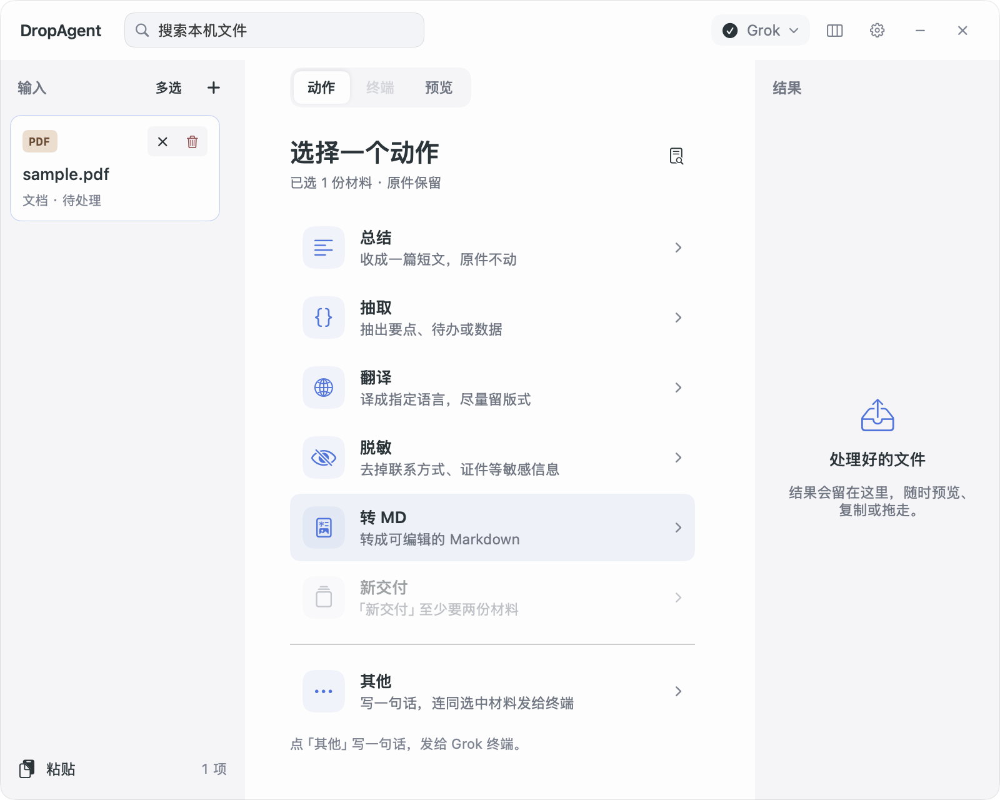
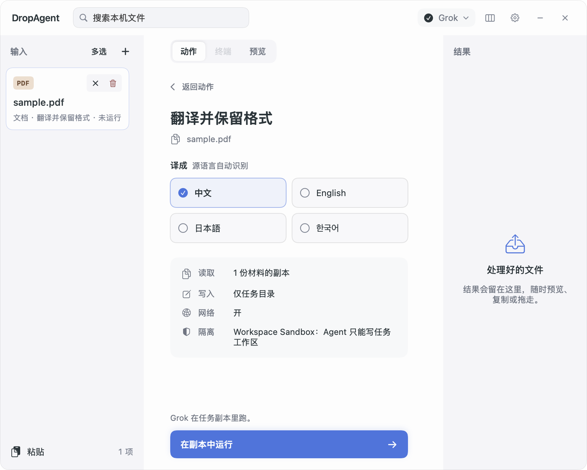
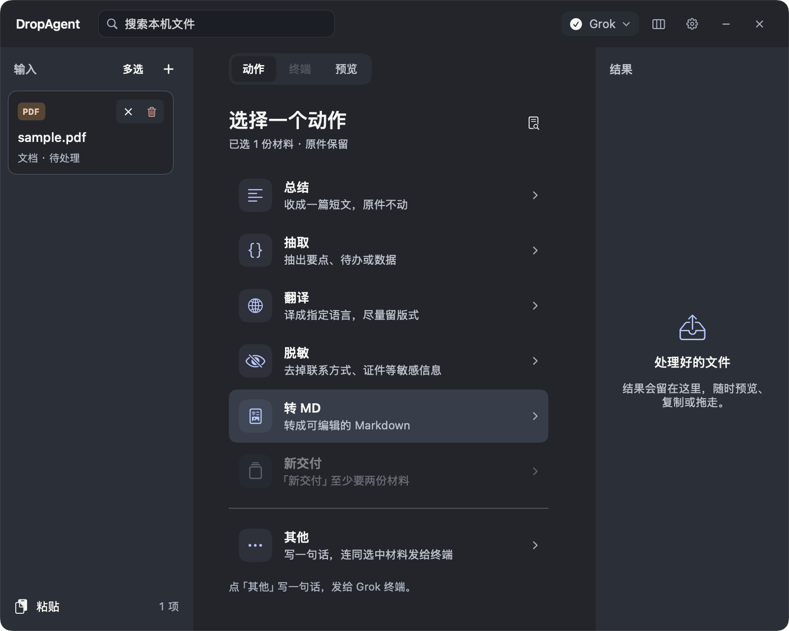

# DropAgent 第二轮打磨

2026-09-08。继续基于远端 `b5b46cb` 与第一轮本地成果。用户补充要求：**不要绿色**。

当前方案使用冷白、石墨灰和少量蓝色；去掉动作列表的成排灰框，重新安排页签、确认页、输入框和文稿预览。保留远端三栏、收起、轮盘、六种动作、终端与设置能力，沿用系统框架，没有增加外部依赖。

评审包：`macos/dist/DropAgent Review.app`。数据仍在 `~/Library/Application Support/DropAgent Review`，未替换日常版，未提交或推送。

## 查看变化

下列截图来自原生 Preview 的代表性材料，是布局辅助证据：







- 冷白工作面与灰色侧栏建立层次；选中、运行、标签及深色模式均移除绿色。
- 动作行以图标、名称和说明组织，悬停才显底色；不足两份材料等条件直接显示。
- 页签采用分段控件，选中底片短距离移动；内容切换轻微淡入，终端实例不重建。
- 确认页显示当前材料、选项、真实权限边界和运行按钮；返回动作更明确。
- 自定义输入框获得更完整的宽度，保留「发送到终端，不是副本沙箱」说明。
- 预览正文扩大字号和行距，标题、段落、列表层级清楚；列表键盘切换同步滚动。
- 常规反馈约 180ms，页签采用短弹簧；减少动态效果时取消位移动画。主观手感需真人验收。

## 已修复的问题

| 触发路径 | 修复后的行为 |
| --- | --- |
| 分别给两份材料选择不同动作，然后再多选 | 新确认替换旧确认；执行前检查动作一致性与任务状态 |
| 从右侧结果切回「动作」 | 明确恢复输入对象，输入与结果不再同时显示为当前操作对象 |
| 没选输入时点「预览」 | 打开已有结果，不留空白页 |
| 隐藏当前结果，还有其他结果 | 选择相邻结果；没有结果时回到动作 |
| 任务中切换到另一份材料，想返回或取消 | 页签旁「运行中」返回正在处理的材料；取消按钮是独立可访问控件 |
| 已切换材料或开始写另一段输入，前一任务完成 | 更新结果栏，保留当前材料、页签与草稿；仍在跟随任务时才自动预览 |
| 面板退到后台后通过无障碍点击操作 | 主动操作同时唤醒面板，内容与视觉反馈保持一致 |
| 在列表中持续用方向键移动 | 视口随选中行滚动 |
| 预览有序列表或 `#标签` | 保留原有编号；标签不再误当标题 |

## 验证与边界

当时的构建、内核检查、应用链路、打包、签名与差异检查通过。原始日志已于 2026-09-10 从仓库当前版本移除，并保留本地备份；复现命令见下文。内核检查中可选浏览器抓页探针显示 `captureFailed`；该项不记为本轮通过，网页接收与 Grok 终端启动有成功记录。自动化 E2E 中 Recipe 使用测试替身，证明应用状态和文件链路，不能代表全部真实模型产出质量。Preview 截图不等于真人验收。

本轮实际运行使用独立评审包、本机 Grok 与中文示例 Markdown。检查范围包括选项、运行反馈、切换材料、返回运行任务、取消恢复、真实翻译结果和新输入框。指定路径实操完成：任务中切换另一份材料，从「运行中」返回并取消，原材料回到待处理；再次运行翻译时，切到另一份材料并输入草稿。真实任务完成后，结果从 4 项变为 5 项，输入框仍保持焦点，草稿逐字保留，没有跳到预览。清理测试草稿后，点选新结果可查看干净的 Markdown。

成功任务：`3F5FD33A-9278-4580-B889-AD12E314BB28`。见[真实翻译结果](真实翻译结果.md)和[运行证据](真实运行证据.json)。原件与 input 快照字节一致；操作通过原生 UI 工具进行，工具等待时间不代表产品响应时延，也不代表真人验收。

`UNVERIFIED`：中文输入法候选窗、VoiceOver 连续听感、主观视觉／动效手感、跨 App 真实拖拽与轮盘、复杂 PDF 和长文、其他 Agent 的所有组合。系统授权未调整；当前运行时的工作区限制仍按探测结果显示。

## 保留与复现

第一轮完整改动保留在 `/tmp/dropagent-before-round2-20260908`。本轮只迭代 DropAgent 仓库和独立评审包。

```bash
swift run --package-path macos DropAgentCheck
swift build --package-path macos --product DropAgent
DROPAGENT_VARIANT=review bash macos/package-app.sh
DROPAGENT_ROOT=/tmp/dropagent-round2-final-e2e "macos/dist/DropAgent Review.app/Contents/MacOS/DropAgent" --e2e
open "macos/dist/DropAgent Review.app"
```
